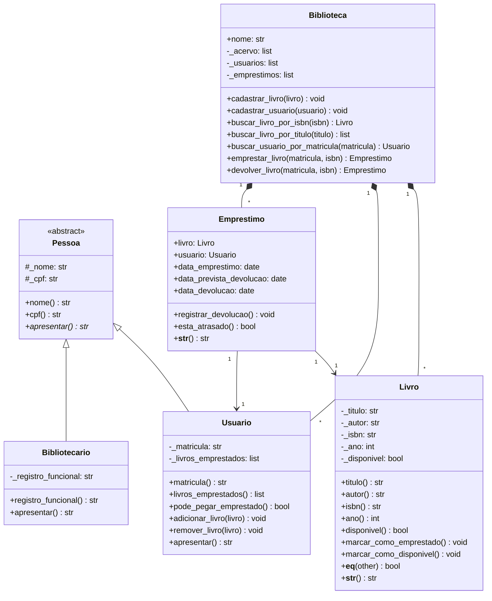

# 📚 Sistema de Gestão de Acervo Bibliotecário

Projeto prático desenvolvido para demonstração dos pilares de Programação Orientada a Objetos (POO) em Python: abstração, herança, polimorfismo, encapsulamento e tratamento de exceções.

---

## 📌 Funcionalidades
- Cadastro de livros com controlo de estado (disponível/emprestado).
- Diferenciação de perfis (`Usuário` e `Bibliotecário`) a partir da classe abstrata `Pessoa`.
- Gestão de empréstimos com limite por leitor (máximo de 3 exemplares).
- Prazos automáticos de devolução (14 dias) e identificação de atrasos.
- Busca no acervo por título parcial ou ISBN exato.
- Utilização de decoradores para registo de operações concluídas com sucesso.

---

## 🛠️ Tecnologias e Bibliotecas
- **Python 3.10+**
- Módulos nativos da linguagem: `abc`, `datetime`, `functools`

---

## 📐 Diagrama de Classes



---

## 🚀 Como Executar

```bash
python src/main.py
```

---

## 👥 Divisão de Tarefas

| Integrante | Atribuição / Responsabilidade |
| :--- | :--- |
| **Integrante 1** | Modelagem das entidades `Pessoa`, `Usuario` e `Bibliotecario` (Herança e Polimorfismo) |
| **Integrante 2** | Modelagem das classes `Livro` e `Emprestimo` (Regras de comparação e datas) |
| **Integrante 3** | Classe `Biblioteca`, Dunder Methods e gestão central do acervo |
| **Integrante 4** | Exceções personalizadas, Decoradores e script `main.py` de testes |
